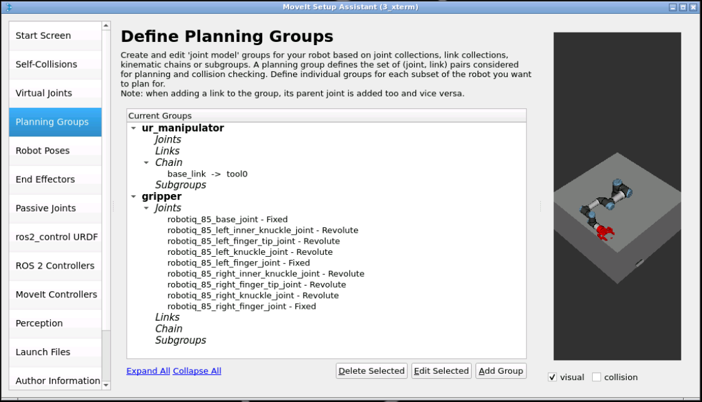

# Introduction to Robotics Manipulation

In robotics, manipulation refers to a robot's ability to interact with objects in its environment. 

A typical example is picking up an object and moving it to a new location.

The objectives of this course are:
- How to set up a MoveIt2 configuration package for a manipulator robot
- How to use MoveIt2 in ROS2 programmatically in C++
- Different types of motion planning
- How to use Perception to find object coordinates in the environment
- How to create a Pick and Place task in ROS2

Webbiography:
- https://github.com/UniversalRobots
- https://github.com/UniversalRobots/Universal_Robots_ROS2_Documentation
- https://github.com/UniversalRobots/Universal_Robots_ROS2_Driver
- https://github.com/UniversalRobots/Universal_Robots_ROS2_Description
- https://github.com/UniversalRobots/Universal_Robots_ROS2_GZ_Simulation

## Set up a UR Description configuration package
We will need to install the following packages:
````shell
unset COLCON_PREFIX_PATH
unset AMENT_PREFIX_PATH
unset CMAKE_PREFIX_PATH
rm -rf build/ install/ log/
colcon build
source install/setup.bash
````
We have now our workspace ready with the gripper only used for simulation purposes.

## Set up a MoveIt2 configuration package for a manipulator robot

 MoveIt is a ROS framework that allows you to perform motion planning with a specific robot.

 it enables you to plan a movement (motion) from point A to point B without colliding with anything.

 MoveIt2 provides a friendly and easy-to-use GUI, which helps you interact with the robot to perform motion planning.

 Webgraphy:
 - [moveit_install](https://moveit.ai/install-moveit2/binary/)
 - [moveit_Documentation](https://moveit.picknik.ai/humble/index.html)

First of all, we need to install moveit2 packages:
 ````shell
 sudo apt install ros-humble-moveit
 ````
 The `MoveIt Setup Assistant` is typically used to generate and configure this package easily.
 ````shell
 ros2 launch moveit_setup_assistant setup_assistant.launch.py
 ````
The next thing you'll need to do is load your robot file. 
- Click on the Create New MoveIt Configuration Package button.
- Now, click the Browse button. Select the URDF file named `ur_moveit.urdf.xacro`. Great! So, you've loaded the xacro file of your robot to the MoveIt Setup Assistant. Now, let's start configuring some things.
- Select `Self-Collisions`:
    - Set the Sampling Density value to the maximum
    - choose any value between 95% to 99% for the Min. collisions for "always"-colliding pairs
    - click on the Generate Collision Matrix button
- Select `Virtual joints`: they are used to attach the robot to the world.
    - Create a virtual joint named `fixed_base`, which attaches the base_link frame to the world frame. 
- Open the "Planning Groups" tab and click the "Add Group" button:
    -  create a new group called ur_manipulator, which will use the KDLKinematicsPlugin.
    - Next, click on the Add Kin. Chain button
    - Then select (from the Robot Links list) both the Base Link and Tool0 Link that form the robot's arm, excluding the gripper. 
    - click on the Save button to finish the configuration.
- You have now defined a group of joints for performing Motion Planning, and you've defined the plugin you want to use to calculate those plans.
- Let's also define another planning group for the gripper (`add group`)
    - Select `add joints` an choose the robotiq gripper joints.
    - save the configuration.
    
- Now, create a couple of predefined poses for your robot arm.
    -  define a pose which is named `home`, with the following joint position values:0, -2.5, 1.5, -1.5, -1.5, 0
    - define a pose which is named `gripper_open`, with the following joint position values:0
    -  define a pose which is named `gripper_close`, with the following joint position values:0.78
- Define a new end effector named `hand_ee` with the following configuration:
    - Set the End Effector Group to gripper
    - Set the Parent Link to wrist_3_link. This is the last link of the arm where the end effector is attached.
    - Set the Parent Group to ur_manipulator.
- Next, define the ROS Controllers (`MoveIt Controllers`) that allow you to interact (and execute the motions) within the Gazebo simulation.
    - click on the Auto Add FollowJointsTrajectory Controllers For Each Planning Group button
    - That's it! You have just defined the MoveIt Controllers that will allow the MoveIt2 package to plan and execute the motions on the simulated robot. 
- You need to fill in the Author Information
- go to the "Configuration Files" tab:
    - click the "Browse" button. 
    - Navigate to the ros2_ws/src directory, 
    - create a new directory, and name it my_moveit_config. "Choose" the directory you've just created.
    - click the Generate Package button.

- Finally, the last step will be to build your workspace:
````shell
colcon build
source install/setup.bash
````
## Fine tune the generated MoveIt2 package
